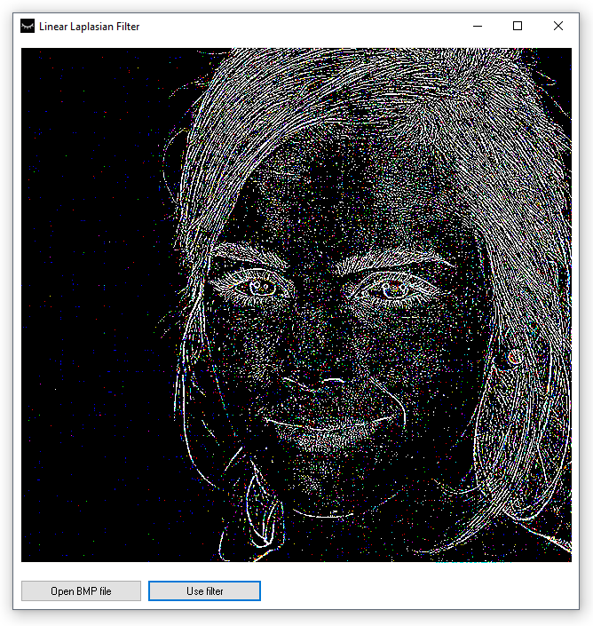

## Linear Laplacian filter implementation with Delphi

This application demonstrates Laplacian filtering.

Created with Borland Delphi back in 2013, updated with Embarcadero RAD Studio 10.

Works with `BMP` files.

Please notice, **it's very slow**, since it processes the image pixel by pixel.

Compiled binary is included, see the [LinearLaplasianFilter.7z](LinearLaplasianFilter.7z) file.

### Instructions

- Click `Open BMP file` to open the file.

- Click `Use filter` to apply the filtering.

### Requirements

**OS**: Windows 10 x32 / x64 (to run the compiled binary).

**IDE**: Embarcadero RAD Studio 10

